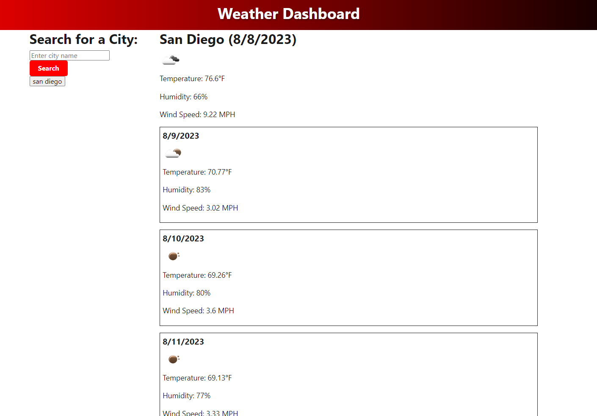

# Weather Dashboard

This Weather Dashboard provides the user with a 5 day forecast of any city they search for. The weather report displays the temperature, humidity, and wind speed for each day. The dashboard also keeps a record of the last 5 searches the user searched so they can access their history easily. 

## Screenshots

## FAQ

#### How do I use this weather dashboard?

- To use the weather dashboard, simply enter the name of a city in the search bar and click the "Search" button. The dashboard will then display the current weather conditions for the entered city, along with a 5-day forecast. The city will also be added to the search history list for easy access in the future.

#### How does the search history work? 

- The search history keeps track of the cities you've searched for in the past. Up to the last 5 cities you've searched for will be displayed in the search history section. Clicking on any of the cities in the search history will immediately fetch and display the current weather and forecast for that city.

#### Can I see weather data for different times of the day? 

- The weather dashboard displays data for a specific time of day, which is noon (12:00 PM). This approach helps provide consistent and concise weather information for each day.

## Deployment

To deploy this project follow this url: https://cody-and.github.io/5-Day-Weather-Forecast/

